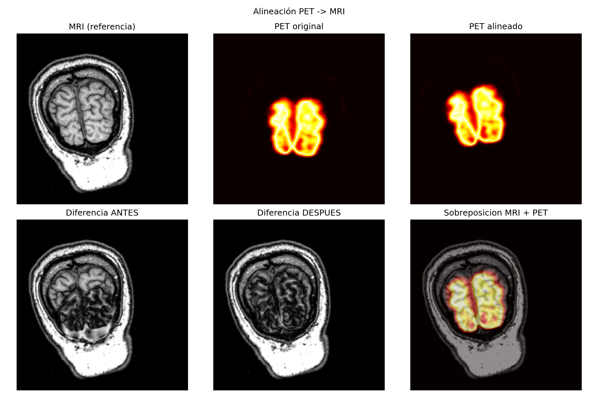
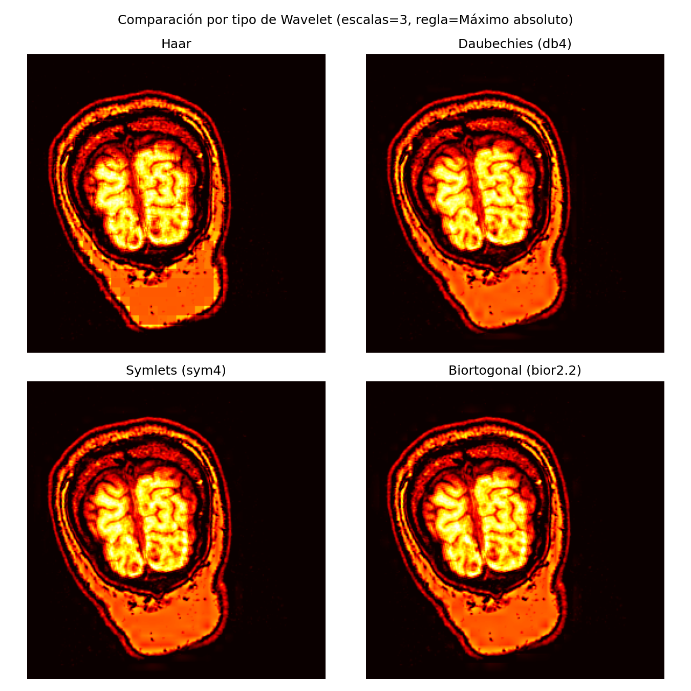
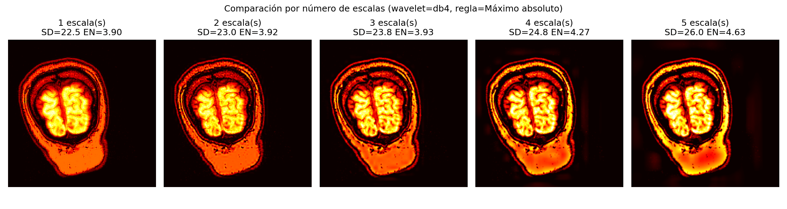
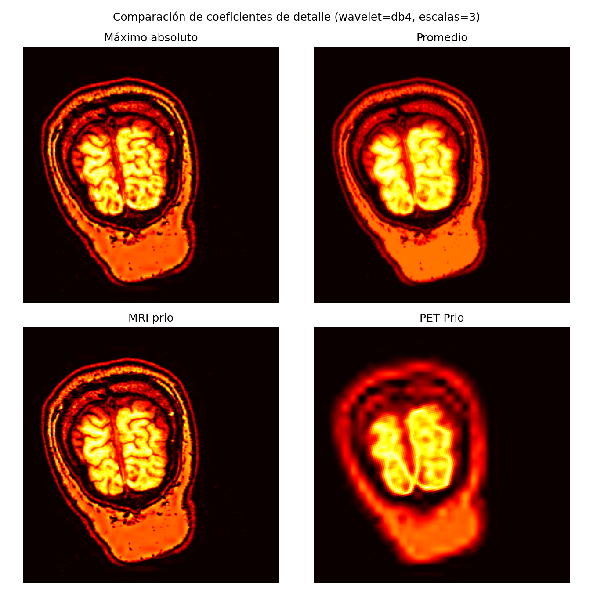

# Fusión wavelet de imágenes PET–MRI

> **EN —** Multiscale wavelet fusion of a registered PET/MRI pair. The study sweeps three variables:
> wavelet family (Haar, Daubechies, Symlets, Biorthogonal), number of decomposition levels (1–5) and
> the rule used to select detail coefficients (absolute maximum, average, MRI priority, PET priority),
> producing a side-by-side comparison of each.

## Objetivo

Combinar la información **anatómica** de la MRI con la **funcional** del PET en una sola imagen,
usando la transformada wavelet discreta: se descomponen ambas imágenes, se fusionan sus coeficientes
según una regla, y se reconstruye.

## Experimentos

| Variable | Valores probados |
|---|---|
| Familia wavelet | Haar, Daubechies, Symlets, Biorthogonal |
| Escalas de descomposición | 1 a 5 niveles |
| Regla para coeficientes de detalle | Máximo absoluto · Promedio · Prioridad MRI · Prioridad PET |

El script reutiliza el shader de alineación del [registro PET–MRI](../registro-pet-mri/) para dejar
ambas imágenes en el mismo marco antes de fusionar.

## Stack

`PyWavelets` · `OpenCV` · `PyOpenGL` · `glfw` · `NumPy` · `SciPy` · `Matplotlib`

## Cómo ejecutar

```bash
pip install PyWavelets opencv-python PyOpenGL PyOpenGL_accelerate glfw numpy scipy matplotlib
python fusion-wavelet-pet-mri.py
```

## Resultados

Alineación previa a la fusión:



Comparación entre familias wavelet:



Efecto del número de escalas:



Efecto de la regla de selección de coeficientes:



---

<sub>Visualización e Imagenología Médica por Computadora (VIMC) — UAM, trimestre 26-P.</sub>
