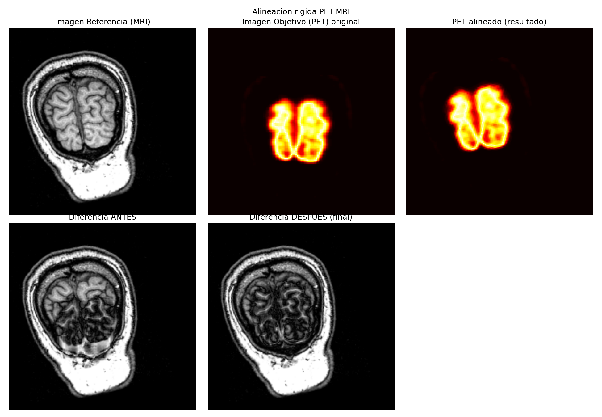
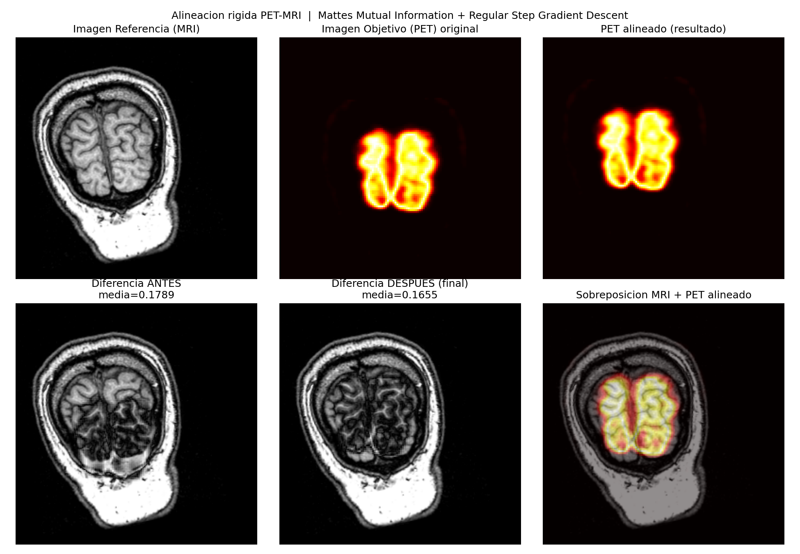

# Registro rígido multimodal PET–MRI

> **EN —** Rigid 2D registration of PET onto MRI head images, implemented twice for comparison:
> once resampling on the GPU with a custom GLSL shader and optimising Normalised Mutual Information
> with Powell's method, and once with SimpleITK using Mattes Mutual Information and Regular Step
> Gradient Descent. The GPU version shows the transform step running as a fragment shader instead of
> a library resampler.

## Objetivo

Alinear una imagen PET (móvil) sobre una MRI de cabeza humana (referencia). Al ser modalidades
distintas, las intensidades no son comparables directamente: la métrica de similitud debe ser
**información mutua**, no diferencia cuadrática.

## Dos implementaciones

| Archivo | Transformación | Métrica | Optimizador |
|---|---|---|---|
| [`registro-pet-mri-opengl.py`](registro-pet-mri-opengl.py) | Shader GLSL sobre GPU | Información Mutua Normalizada (histograma 2D en NumPy) | Powell (`scipy.optimize`, sin derivadas) |
| [`registro-pet-mri-simpleitk.py`](registro-pet-mri-simpleitk.py) | `Euler2DTransform` (SimpleITK) | Mattes Mutual Information | Regular Step Gradient Descent |

La versión OpenGL ejecuta el paso *«A Transformar»* del pipeline de registro como un shader: el
vértice aplica la matriz de rotación y la traslación en coordenadas normalizadas, y el fragmento
remuestrea la textura móvil. La métrica se lee de vuelta desde la GPU, por lo que no es diferenciable
analíticamente — de ahí la elección de Powell.

## Stack

`PyOpenGL` · `glfw` · `SimpleITK` · `NumPy` · `SciPy` · `Pillow` · `Matplotlib`

## Datos

`PET.png` y `MRI.png` (256×256) están incluidos en esta carpeta.

## Cómo ejecutar

```bash
pip install PyOpenGL PyOpenGL_accelerate glfw numpy scipy matplotlib pillow SimpleITK
python registro-pet-mri-opengl.py      # requiere GPU con OpenGL 3.3
python registro-pet-mri-simpleitk.py   # solo CPU
```

## Resultados

Registro por shader OpenGL:



Registro con SimpleITK, mostrando la imagen diferencia `|f_R − f_T|` antes y después:



---

<sub>Visualización e Imagenología Médica por Computadora (VIMC) — UAM, trimestre 26-P.</sub>
